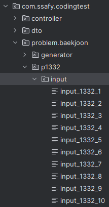
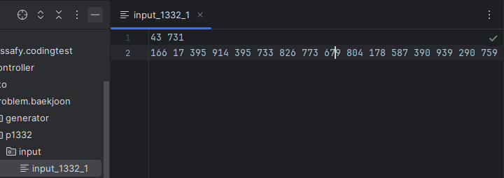
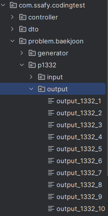
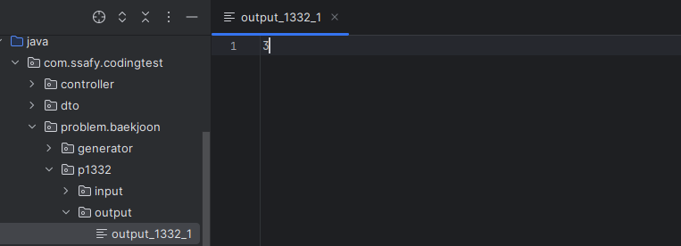
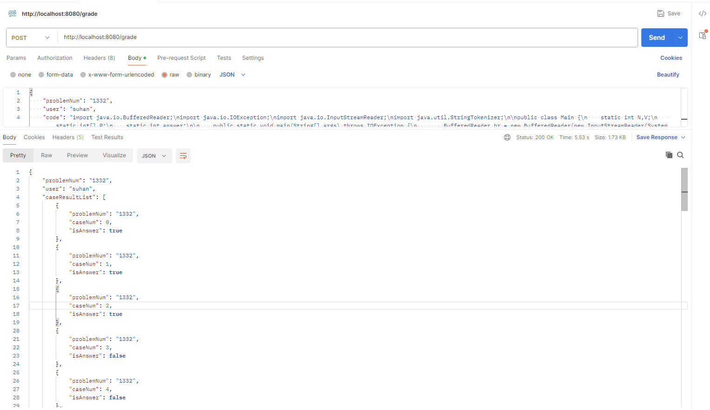
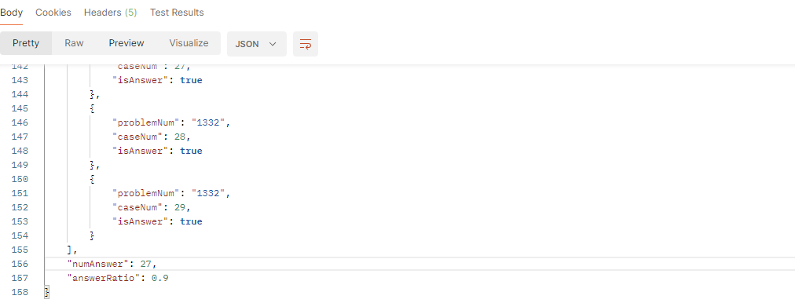

# 코딩테스트 채점 API 구현

[github](https://github.com/sem1308/codingtest)

## 1. 제출한 데이터를 수신하고 결과 반환하는 API 서버 구현
#### 채점을 위한 controller 구현 : GradingController
```java
@RestController
@RequestMapping("/grade")
@RequiredArgsConstructor
public class GradingController {

    private final GradingService gradingService;

    /**
     * userAnswer : 
     * {
     *    "problemNum" : "2609",
     *    "user" : "hshhan0221",
     *    "code" : "import ... "
     * }
     * 위 데이터를 받아 채점한 후 결과 반환
     * 결과 형식은 다음과 같음
     * {
     *    "problemNum" : "2609",
     *    "user" : "hshhan0221",
     *    "caseResultList" : [
     *       {
    *           "problemNum" : "2609",
    *           "caseNum" : 0,
    *           "isAnswer" : true,
     *       },
     *       {
    *           "problemNum" : "2609",
    *           "caseNum" : 1,
    *           "isAnswer" : false,
     *       },
     *    ],
     *    "numAnswer" : 10,
     *    "answerRatio" 1.0
     * }
     */
    @PostMapping
    public ResponseEntity<?> grading(@RequestBody UserAnswer userAnswer) throws IOException, InterruptedException {
        // 유저 데이터를 통해 채점
        List<CaseResult> caseResultList = gradingService.grading(userAnswer.getProblemNum(), userAnswer.getCode());

        // 채점 결과 저장
        UserAnswerResponse response = UserAnswerResponse.builder()
            .user(userAnswer.getUser())
            .problemNum(userAnswer.getProblemNum())
            .caseResultList(caseResultList)
            .build();

        // 정답수, 정답률 등록
        response.setInfo();

        return ResponseEntity.ok().body(response);
    }
}
```

유저 데이터를 받아 gradingService의 채점 메소드를 호출하여 결과를 반환한다.

gradingService의 채점 로직은 다음 링크에서 설명하겠다. [채점 로직](#3-정답-여부-판별)

#### request body에 사용되는 클래스 : UserAnswer
```java
@Getter
@Builder
@AllArgsConstructor
@ToString
public class UserAnswer {
    String problemNum; // 문제 번호
    String user; // 유저 아이디 or 이름
    String code; // 유저 코드
}
```

#### 결과 반환 클래스 : UserAnswerResponse
```java
@Getter
@Builder
@AllArgsConstructor
@ToString
public class UserAnswerResponse {
    String problemNum; // 문제 번호
    String user; // 유저 아이디 or 이름
    List<CaseResult> caseResultList; // 테스트케이스 정답 결과 목록
    int numAnswer; // 정답수
    float answerRatio; // 정답률

    // 정답수, 정답률 등록
    public void setInfo(){
        numAnswer = 0;
        caseResultList.forEach(caseResult -> {
            if(caseResult.getIsAnswer()) numAnswer++;
        });
        answerRatio = (float) numAnswer / caseResultList.size();
    }
}
```

#### 해당 문제의 몇번 테스트 케이스가 맞았는지 저장하는 클래스 : CaseResult
```java
@Getter
@Builder
public class CaseResult {
    String problemNum; // 문제 번호
    int caseNum; // 테스트 케이스 번호
    Boolean isAnswer; // 정답 여부
}
```

## 2. 채점 데이터 프리셋 생성
#### 백준 입.출력 데이터 생성 클래스 : BaekjoonInputOutputGenerator

입력, 출력을 생성하는 함수형 인터페이스를 인자로 받아 데이터를 생성하고 파일로 저장하는 클래스

```java
public class BaekjoonInputOutputGenerator {
    public final static String baseDir = "src/main/java";
    public final static String inputDir = "input";
    public final static String outputDir = "output";
    public final static String packagePath = BaekjoonInputOutputGenerator.class.getPackage().getName().replace('.', '/');

    Path problemPath;
    Path inputDirPath;
    Path outputDirPath;

    Path inputFilePath;
    Path outputFilePath;

    /*
        아래와 같은 폴더 생성 후 데이터 생성
        src/main/java/com/ssafy/codingtest/problem/baekjoon/{문제번호}/input
        src/main/java/com/ssafy/codingtest/problem/baekjoon/{문제번호}/output
    */

    public BaekjoonInputOutputGenerator(String problemNum) {
        this.problemPath = getProblemFolderPath(problemNum);
        this.inputDirPath = problemPath.resolve(inputDir);
        this.outputDirPath = problemPath.resolve(outputDir);
    }

    /*
     * inputFileName : 입력 데이터 파일 이름
     * outputFileName : 출력 데이터 파일 이름
     * 
     * 입력 데이터 생성 후 출력 데이터 생성
     */
    public void makeData(String inputFileName, String outputFileName, Supplier<String> inputFunc, Function<List<String>, String> outputFunc) {
        this.inputFilePath = inputDirPath.resolve(inputFileName);
        this.outputFilePath = outputDirPath.resolve(outputFileName);

        makeInput(inputFunc);
        makeOutput(outputFunc);
    }

    public static Path getProblemFolderPath(String problemNum){
        return Paths.get(baseDir, packagePath, getProblemFolderName(problemNum));
    }

    public static String getProblemFolderName(String problemNum){
        return "p"+problemNum;
    }

    /*
     * func : 입력 데이터 생성 함수
     *
     * 입력 데이터 생성 후 파일 저장
     */
    public void makeInput(Supplier<String> func) {
        String result = func.get();

        // input.txt 파일에 저장
        save(inputFilePath, result);
    }

    /*
     * func : 출력 데이터 생성 함수
     *        - 입력 데이터 파일을 읽은 String 배열을 매개변수로 받음
     * 
     * 출력 데이터 생성 후 파일 저장
     */
    public void makeOutput(Function<List<String>,String> func) {
        // input.txt 파일에서 데이터를 읽고 출력 데이터를 계산하여 output.txt에 저장
        try {
            List<String> lines = Files.readAllLines(inputFilePath, StandardCharsets.UTF_8);
            String result = func.apply(lines);
            // output.txt 파일에 결과 저장
            save(outputFilePath, result);
        } catch (IOException e) {
            throw new RuntimeException(e);
        }
    }

    /*
     * filePath : 파일 저장 경로
     * result : 파일에 넣을 데이터
     * 
     * 파일 생성 후 데이터 삽입
     */
    private void save(Path filePath, String result) {
        try {
            // Ensure the directory exists
            Files.createDirectories(filePath.getParent());
            // Write data to the file
            Files.writeString(filePath, result);
        } catch (IOException e) {
            throw new RuntimeException(e);
        }
    }
}
```

#### 백준 테스트 케이스 데이터 생성 추상 클래스 : BaekjoonGenerator

테스트 케이스 개수 만큼 테스트 케이스 생성 후 저장하는 클래스

```BaekjoonGenerator```를 상속 <br>
```setInputFunc```에는 입력 조건에 맞는 입력을 랜덤하게 생성하는 로직을 구현후 반환 <br>
```setOutputFunc```에는 실제 알고리즘 내용을 등록 <br>
이때, 입력은 stdin이 아니라 ```List<String>```으로 받기 때문에 이에 유의하여 작성한다.

```java
public abstract class BaekjoonGenerator {
    // 입.출력 데이터 생성기
    protected BaekjoonInputOutputGenerator generator;

    // 기본 데이터
    protected String inputFileName; // 입력 데이터 파일 이름
    protected String outputFileName; // 출력 데이터 파일 이름

    
    protected Supplier<String> inputFunc; // 입력 데이터 생성 함수
    protected Function<List<String>, String> outputFunc; // 출력 데이터 생성 함수

    // 테스트 케이스 개수
    protected int size = 10;

    public BaekjoonGenerator(String problemNum) {
        generator = new BaekjoonInputOutputGenerator(problemNum);
        inputFileName = "input_" + problemNum + "_";
        outputFileName = "output_" + problemNum + "_";
        inputFunc = setInputFunc();
        outputFunc = setOutputFunc();
    }

    public abstract Supplier<String> setInputFunc(); // 입력 데이터 생성 함수
    public abstract Function<List<String>, String> setOutputFunc(); // 출력 데이터 생성 함수

    public void generate() {
        for (int i = 1; i <= size; i++) {
            generator.makeData(inputFileName+i,outputFileName+i, inputFunc, outputFunc);
        }
    }
}

```

#### 백준 테스트 케이스 데이터 생성 클래스 (백준 1332번 예시)
```java
public class Baekjoon1332Generator extends BaekjoonGenerator {
    // 알고리즘에 필요한 데이터
    Random random = new Random();
    int MAX_N = 50;
    int MAX_V = 1000;

    public static void main(String[] args) {
        Baekjoon1332Generator baekjoon1332Generator = new Baekjoon1332Generator();
        baekjoon1332Generator.size = 30;
        baekjoon1332Generator.generate();
    }

    public Baekjoon1332Generator(){
        super("1332");
    }

    // 입력 데이터 생성 함수
    @Override
    public Supplier<String> setInputFunc() {
        return () -> {
            // 문제의 개수 N과 최댓값과 최솟값의 차이 V 생성
            int N = random.nextInt(MAX_N) + 1; // 1 이상 50 이하의 자연수
            int V = random.nextInt(MAX_V) + 1; // 1 이상 1000 이하의 자연수

            // 유진이가 느끼는 흥미도 P 배열 생성
            int[] P = new int[N];
            for (int i = 0; i < N; i++) {
                P[i] = random.nextInt(1001); // 0 이상 1000 이하의 자연수
            }

            // 입력 데이터 출력
            StringBuilder sb = new StringBuilder();
            sb.append(N).append(" ").append(V).append("\n");
            for (int i = 0; i < N; i++) {
                sb.append(P[i]).append(" ");
            }
            sb.append(" ");
            return sb.toString();
        };
    }

    // 출력 데이터 생성 함수
    @Override
    public Function<List<String>, String> setOutputFunc() {
        return (lines) -> {
            String[] numbers = lines.get(0).split(" ");
            int N = Integer.parseInt(numbers[0]);
            int V = Integer.parseInt(numbers[1]);

            int[] P = new int[N];

            numbers = lines.get(1).split(" ");
            for (int i = 0; i < N; i++) {
                P[i] = Integer.parseInt(numbers[i]);
            }

            int answer = N;

            for (int i = 0; i < N; i++) {
                for (int j = i+1; j < N; j++) {
                    if(Math.abs(P[i] - P[j]) >= V){
                        // 최소, 최대 차이가 V 이상인 경우
                        int cnt = 1 + (i + 1)/2 + (j - i + 1)/2;
                        answer = Math.min(answer, cnt);
                    }
                }
            }

            return String.valueOf(answer);
        };
    }
}
```

결과는 다음과 같이 저장된다.

- input




- output




## 3. 정답 여부 판별
#### 사용자 코드를 컴파일 한 후 데이터를 받아 실행하는 클래스 구현 : JavaExecutor

아래 class의 ```saveAndCompile```을 통해 파일 저장 및 컴파일을 하고 ```run``` 함수를 통해 파일 데이터를 입력으로 하여 실행 결과를 받아올 수 있다.

```java
public class JavaExecuter {
    String baseDir = "temp"; // 실행 파일이 생성될 폴더의 폴더
    String folderName; // 실행 파일이 생성될 폴더
    String fileName = "Main.java"; // 실팽 파일 이름
    
    // 폴더 경로 설정
    Path folderPath;
    Path filePath;

    public void saveAndCompile(String code){
        save(code);
        compile();
    }

    // 코드 String을 파일로 저장
    public void save(String code){
        // UUID 기반 폴더 이름 생성
        folderName = UUID.randomUUID().toString();
        // 폴더 경로 설정
        folderPath = Paths.get(baseDir, folderName);
        filePath = folderPath.resolve(fileName);
        // 폴더 생성 및 Java 소스 코드 파일로 저장
        try {
            Files.createDirectories(folderPath);
            Files.writeString(filePath, code, StandardCharsets.UTF_8);
            System.out.println("Java source code has been written to " + filePath.toString());
        } catch (IOException e) {
            System.err.println("An error occurred while writing the Java source code: " + e.getMessage());
        }
    };

    // 파일을 읽어 컴파일후 클래스 파일 저장
    public void compile(){
        try {
            Process compileProcess = new ProcessBuilder("javac","-encoding","UTF-8", filePath.toString()).inheritIO().start();
            compileProcess.waitFor();
            if (compileProcess.exitValue() == 0) {
                System.out.println("Java source code compiled successfully.");
            } else {
                System.err.println("Compilation failed.");
            }
        } catch (IOException | InterruptedException e) {
            System.err.println("An error occurred during compilation: " + e.getMessage());
        }
    };

    // 클래스 파일을 읽고 입력 데이터를 넣어 실행후 출력 결과 반환
    public String run(Path inputFilePath) throws IOException, InterruptedException {
        Process runProcess = new ProcessBuilder("java", "-cp", folderPath.toString(), "Main").start();

        // 프로세스에 입력 스트림 연결
        PrintWriter processInput = new PrintWriter(new OutputStreamWriter(runProcess.getOutputStream()));

        // 파일에서 입력을 읽어 프로세스에 전달
        BufferedReader inputFileReader = new BufferedReader(new InputStreamReader(Files.newInputStream(inputFilePath)));
        String line;
        while ((line = inputFileReader.readLine()) != null) {
            processInput.println(line);
        }
        processInput.flush();

        // 프로세스의 stdout 출력
        StringBuilder sb = new StringBuilder();

        BufferedReader processOutput = new BufferedReader(new InputStreamReader(runProcess.getInputStream()));
        String outputLine;
        while ((outputLine = processOutput.readLine()) != null) {
            sb.append(outputLine).append("\n");
        }

        runProcess.waitFor();

        return sb.toString().trim();
    }

    // 실행 폴더 및 파일 삭제
    public void remove() {
        try {
            Files.walk(folderPath)
                .sorted((a, b) -> -a.compareTo(b)) // 하위 폴더부터 삭제하기 위해 역순 정렬
                .map(Path::toFile)
                .forEach(File::delete);
        } catch (IOException e) {
            throw new RuntimeException(e);
        }
    }

}

```

#### UserAnswer에 있는 problemNum와 code를 통해 채점하는 service 구현 : GradingService

각 테스트 케이스마다 실행 결과를 저장하고 실제 정답과 비교하여 몇변 문제의 몇번 테스트케이스가 맞았는지 여부를 저장한다.

```java
@Service
public class GradingService {
    public List<CaseResult> grading(String problemNum, String code) throws IOException, InterruptedException {
        // 컴파일, 실행을 위한 클래스
        JavaExecuter executer = new JavaExecuter();
        executer.saveAndCompile(code); // 코드 파일 저장 및 컴파일

        // 테스트케이스 폴더 경로
        Path folderPath = BaekjoonInputOutputGenerator.getProblemFolderPath(problemNum);

        // 입력 테스트케이스 폴더 경로
        Path inputDirPath = folderPath.resolve(BaekjoonInputOutputGenerator.inputDir);

        // 출력 테스트케이스 폴더 경로
        Path outputDirPath = folderPath.resolve(BaekjoonInputOutputGenerator.outputDir);

        // Files.walk()를 사용하여 폴더 내 모든 파일 경로를 가져옴 - 모든 테스트케이스 가져옴
        List<Path> inputPaths = Files.walk(inputDirPath).filter(Files::isRegularFile).toList();
        List<Path> outputPaths = Files.walk(outputDirPath).filter(Files::isRegularFile).toList();

        // 해당 문제의 몇번 테스트 케이스가 맞았는지 저장하는 변수
        List<CaseResult> isAnswerList = new ArrayList<>();

        // 실행 후 결과 저장
        for (int i = 0; i < inputPaths.size(); i++) {
            Path inputPath = inputPaths.get(i);
            Path outputPath = outputPaths.get(i);

            String result = executer.run(inputPath);
            String answer = Files.readString(outputPath);

            boolean isAnswer = result.equals(answer);
            isAnswerList.add(CaseResult.builder()
                .problemNum(problemNum)
                .caseNum(i)
                .isAnswer(isAnswer)
                .build());
        }

        // 코드 파일 및 폴더 삭제
        executer.remove();

        return isAnswerList;
    }
}
```

#### 해당 문제의 몇번 테스트 케이스가 맞았는지 저장하는 클래스 : CaseResult
```java
@Getter
@Builder
public class CaseResult {
    String problemNum;
    int caseNum;
    Boolean isAnswer;
}
```

## 4. POST MAN을 통한 API 테스트
#### 정답 코드가 아닌 경우 (90% 정답)


#### 정답 코드인 경우
